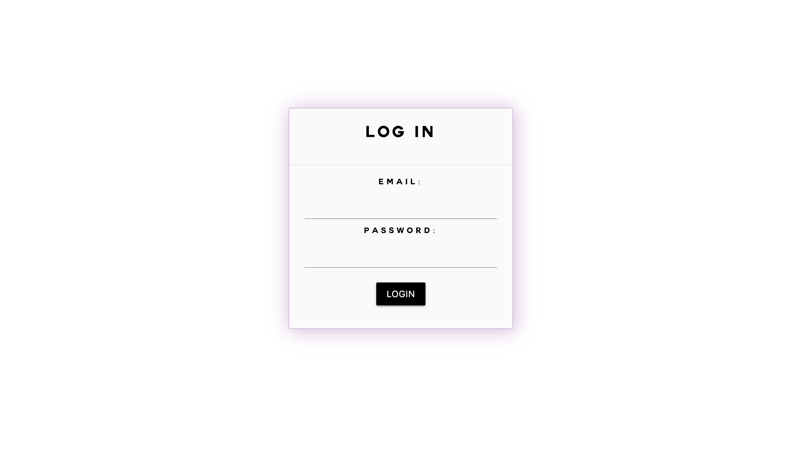
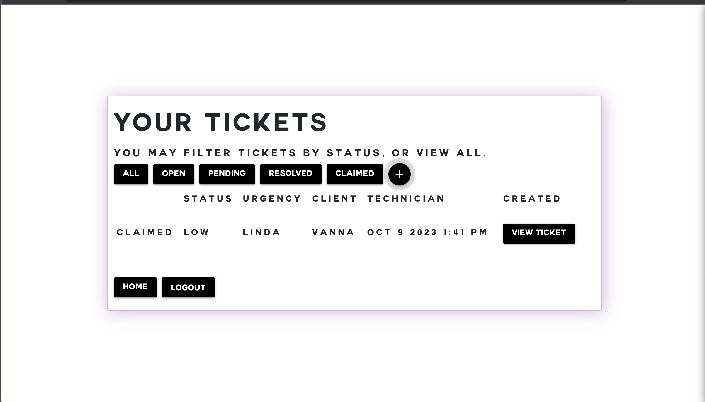
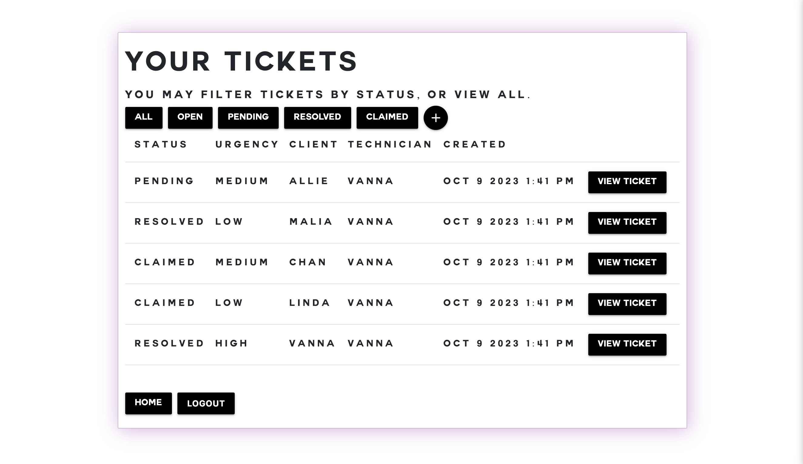
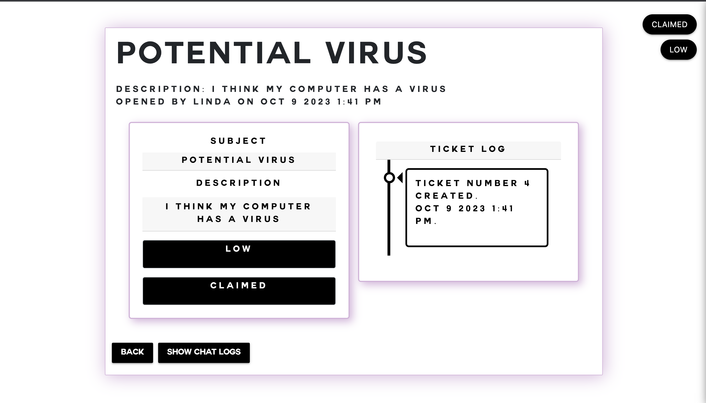

# Girls-Help-Desk

## Description
The motive behind this project was to create a help desk for claim tickets. It will save the companies a ton of time organizing claims made by their clients. We learned how to implement an MVC view engine using handlebars syntax, how to create functioning modals, and also how to create different viewing abilities for client vs tech. 
 
## Installation
1. Clone from repo.
2. Open folder with visual studio code or any text editor of choice.
3. Run data base
4. Run 'npm run seed' to seed data
5. Run 'node server' to run code.

## Usage
1. Open localhost port to use application
2. Enter login information to view claims

3. Client can filter claim tickets by all, open, pending, resolved, or claimed.

4. Techs can view all tickets

5. Ticket view shows description and timeline of ticket logs

## Deployed Link
[Click here for deployed application]()